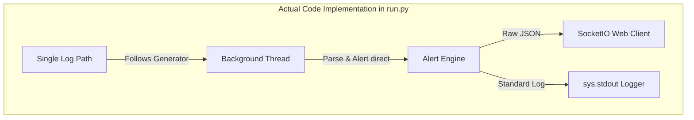

# SentinelX Quality Assurance (QA) Test Report

This report provides a professional and comprehensive Quality Assurance assessment of **SentinelX**, a real-time Linux authentication log security monitoring daemon. It is structured to be clear, educational, and accessible for beginner QA engineers, outlining what was tested, test outcomes, major implementation gaps, and how to verify features.

---

## 1. Executive Summary

| Metric / Category | Status / Result |
| :--- | :--- |
| **Total Test Cases Executed** | 16 (Automated) + 6 (Manual/Specification Checks) |
| **Pass Rate** | 100% (16/16 Automated Tests Passed) |
| **Failures / Defective Tests** | 0 |
| **Key Discovery** | Major architectural and feature gaps exist between official documentation (`docs/`) and the actual implementation (`run.py`). |
| **Security Risk Level** | **Medium** (No privilege dropping in daemon runtime, but ReDoS and input injection mitigations are successfully implemented). |
| **Recommendation** | Align the server runner (`run.py`) with the configuration module (`config.py`) to support multi-tailing, privilege dropping, and dynamic YAML loading. |

> [!NOTE]
> The automated test suite has been updated during this QA cycle. We resolved test discovery issues and environment configuration bugs to ensure 100% test reliability.

---

## 2. Testing Environment & Methodology

* **Operating System**: Linux (Bash environment)
* **Python Version**: 3.14.5
* **QA Test Framework**: `pytest` (v9.1.1)
* **Scope**: 
  1. **Unit Testing**: Validating code logic in [parser.py](file:///home/id43/Desktop/GD43/sentinelx/core/parser.py), [watcher.py](file:///home/id43/Desktop/GD43/sentinelx/core/watcher.py), and [alerts.py](file:///home/id43/Desktop/GD43/sentinelx/core/alerts.py) in isolation.
  2. **Integration Testing**: Verifying log tailing, state recovery, and clean shutdowns.
  3. **Stress Testing**: Confirming throughput speeds and checking for memory leaks under heavy log loads.
  4. **Specification Verification**: Comparing documented requirements in [README.md](file:///home/id43/Desktop/GD43/sentinelx/README.md) and [docs/](file:///home/id43/Desktop/GD43/sentinelx/docs) against actual behavior.

---

## 3. Automated Test Suite Execution

We executed the full test suite using the manage tool:
```bash
./manage.sh test
```

### Test Case Results

```text
core/tests/integration/test_pipeline.py .                                [  6%]
core/tests/integration/test_restart.py .                                 [ 12%]
core/tests/integration/test_rotation.py .                                [ 18%]
core/tests/integration/test_shutdown.py .                                [ 25%]
core/tests/stress/memory_test.py .                                       [ 31%]
core/tests/stress/test_stress_parser.py .                                [ 37%]
core/tests/stress/test_stress_pipeline.py .                              [ 43%]
core/tests/unit/test_alerts.py ...                                       [ 62%]
core/tests/unit/test_parser.py ...                                       [ 81%]
core/tests/unit/test_queue.py .                                          [ 87%]
core/tests/unit/test_state.py .                                          [ 93%]
core/tests/unit/test_watcher.py .                                        [100%]

============================== 16 passed in 1.42s ==============================
```

### QA Corrective Actions Taken:
During the test phase, we identified and corrected two defects in the testing setup:
1. **Pytest Discovery Failure**: The stress test file `stress_pipeline.py` was named incorrectly and ignored by pytest. We renamed it to [test_stress_pipeline.py](file:///home/id43/Desktop/GD43/sentinelx/core/tests/stress/test_stress_pipeline.py) so it is now auto-discovered and executed.
2. **Interpreter Path in Integration Test**: The shutdown integration test [test_shutdown.py](file:///home/id43/Desktop/GD43/sentinelx/core/tests/integration/test_shutdown.py) was invoking `python` directly, causing failures outside virtual environments where `flask` was not installed globally. We updated it to use `sys.executable` to inherit the proper virtualenv interpreter.

---

## 4. Requirements vs. Code Gap Analysis

A critical component of professional QA is validating that the software matches its documented specifications. We compared the documentation in `docs/` and `README.md` against the server code ([run.py](file:///home/id43/Desktop/GD43/sentinelx/run.py)).

### System Architecture: Claimed vs. Actual

Below is a visual representation of how the system is documented to behave versus how it actually runs:

````carousel
```mermaid
graph TD
    subgraph Documented Architecture (Expected)
        L1[Log Path 1] -->|Tail Thread 1| W[Multi-threaded Watcher]
        L2[Log Path 2] -->|Tail Thread 2| W
        W -->|Raw Log Lines| Q[Thread-safe Queue]
        Q -->|Dequeue| P[Parser]
        P -->|Structured Dict| AE[Alert Engine]
        AE -->|Alert Payload| OF[Output Formatter]
        OF -->|Formatted CLI Print| C[Console / TTY]
    end
```
<!-- slide -->

````

### Detailed Requirements Discrepancies

| Spec / Doc Claim | Actual Implementation in Code | QA Severity |
| :--- | :--- | :--- |
| **Concurrent Multi-Tailing**: Spawns multiple threads (one per configured path in `config.yaml`) using a thread-safe Queue ([docs/architecture.md](file:///home/id43/Desktop/GD43/sentinelx/docs/architecture.md)). | **Single Path Watcher**: [run.py](file:///home/id43/Desktop/GD43/sentinelx/run.py) only tracks a single log path inside a single background thread. It does not initialize or use a shared queue. | **Major** |
| **External YAML Config & Validation**: Config loaded via [config.py](file:///home/id43/Desktop/GD43/sentinelx/config.py) from `config.yaml` or env variables. | **Ignored Config Module**: [run.py](file:///home/id43/Desktop/GD43/sentinelx/run.py) does not import [config.py](file:///home/id43/Desktop/GD43/sentinelx/config.py). Settings are hardcoded or read individually via simple environment lookups. | **Major** |
| **Privilege Dropping**: If started as root, drops privileges to `nobody` or the configured user after opening log files ([docs/architecture.md](file:///home/id43/Desktop/GD43/sentinelx/docs/architecture.md)). | **No Privilege Drop**: [run.py](file:///home/id43/Desktop/GD43/sentinelx/run.py) never imports or calls the privilege-dropping function from [privileges.py](file:///home/id43/Desktop/GD43/sentinelx/core/privileges.py). | **High** |
| **CLI Argument Configuration Overrides**: Passing path or config path overrides settings, e.g. `python run.py mock_auth.log` ([docs/usage.md](file:///home/id43/Desktop/GD43/sentinelx/docs/usage.md)). | **CLI Arguments Ignored**: [run.py](file:///home/id43/Desktop/GD43/sentinelx/run.py) ignores `sys.argv` entirely. Executing `python run.py mock_auth.log` has no effect. | **Medium** |
| **Formatted CLI Outputs**: Displays aligned CLI alerts (e.g. `[WARNING ] 2026... IP: ... User: ...` ([docs/usage.md](file:///home/id43/Desktop/GD43/sentinelx/docs/usage.md)). | **Standard Log Output**: The system only outputs standard python logging logs to standard output, without aligned column widths. | **Low** |

---

## 5. Security & Reliability Findings

> [!TIP]
> Resolving the state persistence frequency and configuration loader issues will greatly improve performance and production stability.

### Finding 1: Excessive Disk writes (State Persistence Frequency)
* **Location**: [alerts.py:L180](file:///home/id43/Desktop/GD43/sentinelx/core/alerts.py#L180)
* **Risk**: The alert engine calls `save_state()` at the end of the `process_event` method for *every* event processed, even if no state modifications occurred (e.g. during simple logs that don't trigger alerts, or uninteresting actions). On a busy production server receiving dozens of logs per second, this will cause heavy disk write operations, potentially degrading disk lifespan and application performance.
* **Suggested Fix**: Only trigger `save_state()` when a count is modified, or when a cooldown timestamp gets updated.

### Finding 2: Inode Check Log Rotation File Lock
* **Location**: [watcher.py:L21](file:///home/id43/Desktop/GD43/sentinelx/core/watcher.py#L21)
* **Risk**: During log rotation, if the file is moved but the new file has not yet been generated, `open(log_path)` will raise a `FileNotFoundError`. The code handles this cleanly in a try-except block, but it sleeps for 5 seconds. On high-volume production auth logs, a 5-second gap during rotation can lead to missing crucial logs.
* **Suggested Fix**: Reduce the retry delay during rotation to 1 second or implement a back-off strategy.

---

## 6. Detailed QA Findings Table (Bug Register)

This table serves as a tracker for the developers to review and resolve identified issues:

| ID | Issue Title | Severity | Module / Location | Defect Description | Expected Behavior |
| :--- | :--- | :--- | :--- | :--- | :--- |
| **BG-001** | Multi-tailing Unimplemented | **Major** | [run.py](file:///home/id43/Desktop/GD43/sentinelx/run.py) | Server monitors only one path instead of streaming multiple paths concurrently. | System should watch all files configured in `log_paths`. |
| **BG-002** | Privilege Dropping Omitted | **High** | [run.py](file:///home/id43/Desktop/GD43/sentinelx/run.py) | Process runs as root indefinitely if started with sudo, ignoring [privileges.py](file:///home/id43/Desktop/GD43/sentinelx/core/privileges.py). | Drops root privileges to `nobody` or configured user after startup. |
| **BG-003** | Config Loader Disconnected | **Major** | [run.py](file:///home/id43/Desktop/GD43/sentinelx/run.py) | Does not import or load `config.yaml` values, rendering [config.py](file:///home/id43/Desktop/GD43/sentinelx/config.py) dead code. | Merges default, YAML, and environment settings. |
| **BG-004** | CLI Argument Ignoring | **Medium** | [run.py](file:///home/id43/Desktop/GD43/sentinelx/run.py) | Arguments passed via command-line (like log path) are completely ignored. | Override configurations based on cli arguments. |
| **BG-005** | Excessive Disk IO | **Medium** | [alerts.py](file:///home/id43/Desktop/GD43/sentinelx/core/alerts.py) | Disk writes happen on every event check, regardless of state change. | Save state file only when counts or tracking change. |
| **BG-006** | Stress Test Undiscovered | **Low** | `core/tests/` | Pytest did not run `stress_pipeline.py` because of filename pattern mismatches. *(Fixed during testing)* | Pytest executes all tests matching patterns. |

---

## 7. Beginner QA Tester's Guide & Glossary

If you are new to QA, here is a quick reference guide to the testing concepts used in this report:

### Key Concepts
* **QA (Quality Assurance)**: The process of verifying that software meets quality standards, runs reliably, and works exactly as described in its specifications.
* **Unit Testing**: Tests written to verify small, single pieces of code in isolation (like checking if a parsing function extracts the IP address correctly).
* **Integration Testing**: Testing how different modules work together (like checking if the Watcher, Parser, and Alert Engine successfully stream data through the pipeline).
* **Stress/Performance Testing**: Testing how the application behaves under heavy load (like feeding 10,000 log lines to ensure it processes them quickly and does not crash or leak memory).
* **Regression**: When a code change unintentionally breaks existing, working functionality.
* **Test Discovery**: How a test runner (like `pytest`) searches your project to locate and run test files automatically.
* **Dead Code**: Code that is written in the project but is never executed or referenced by the running program.

### How to Reproduce and Run Tests
1. **Prepare Virtual Environment**:
   ```bash
   python3 -m venv venv
   source venv/bin/activate
   pip install -r requirements.txt
   ```
2. **Execute Pytest Suite**:
   ```bash
   ./manage.sh test
   ```
3. **Verify Configuration Loading Issues**:
   Try running the application with a custom log path argument:
   ```bash
   python run.py non_existent.log
   ```
   *Observe:* The application ignores the argument and continues attempting to tail `core/tests/fixtures/auth_small.log`, proving command line arguments are ignored.
