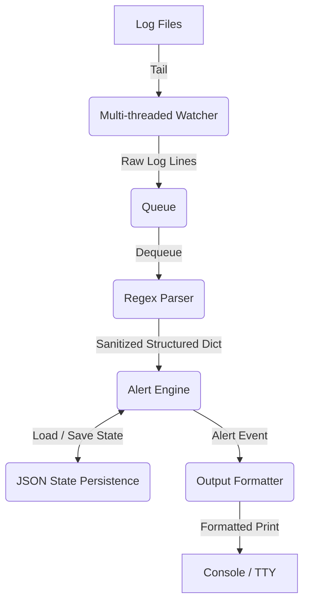

# SentinelX Architecture Guide

This document describes the architectural design and data flow of SentinelX.

---

## 1. High-Level Component Overview

SentinelX is designed around a modular, decoupled architecture consisting of five core components:

### Components

1. **Multi-threaded Watcher (`core/watcher.py`)**:
   - Spawns background daemon threads (one per configured log file).
   - Follows logs in real-time, detecting log rotations (via inode comparison with path `os.stat` checks) and file truncation events.
   - Pushes raw log lines to a thread-safe FIFO Queue.

2. **Regex Parser (`core/parser.py`)**:
   - Consumes raw lines from the queue.
   - Matches lines against compiled SSH log signatures (Failed Password, Invalid User, Accepted Password).
   - Validates formats and performs input sanitization (removing ANSI escape sequences and escaping control characters).
   - Returns structured dictionaries with integer port values.

3. **Alert Engine (`core/alerts.py`)**:
   - Tracks authentication failure frequencies per IP address.
   - Decides alert severity (`info`, `warning`, `critical`) based on configured failure thresholds.
   - Handles brute force state tracking, resets inactive counters, and suppresses rapid alert floods (cooldown).

4. **Privilege Dropper (`core/privileges.py`)**:
   - Enhances host security.
   - If started as root, drops process privileges to a low-privilege user (defaults to `nobody` or the user who invoked `sudo`) immediately after initializing.

5. **State Persistence (`core/alerts.py`)**:
   - Ensures counts are not lost when the SentinelX process restarts.
   - Performs atomic writes (`os.replace`) to write JSON states safely, shielding the state file from write-corruption.

---

## 2. End-to-End Data Flow

The lifecycle of an authentication log line through SentinelX is as follows:

1. **Initialization**:
   - `run.py` loads and validates configurations (`config.py`).
   - If run as root, `drop_privileges` is called.
   - `AlertEngine` loads state from the persistent JSON file.
   - A thread-safe queue is initialized, and a watcher thread is started for each configured log file.

2. **Tailing & Dequeueing**:
   - A watcher thread detects a new append in `auth.log`.
   - The thread reads the line, strips whitespace, and pushes it to the shared queue.
   - The main thread dequeues the line.

3. **Parsing & Sanitizing**:
   - The parser matches the line against compiled regex.
   - If it matches a pattern, fields like username, IP, port, and timestamp are extracted.
   - `sanitize_input` is applied to all string outputs, removing potential escape sequences.

4. **Alert Processing**:
   - `AlertEngine` increments the failure count for the IP or processes a success event.
   - If thresholds are hit and the IP is not in its cooldown window:
     - An alert dictionary is generated.
     - The updated failure count and last alert time are atomically written to `sentinelx_state.json`.

5. **Display**:
   - `run.py` formats the alert using the configured template, date formatting, and icon widths, printing it to stdout.
