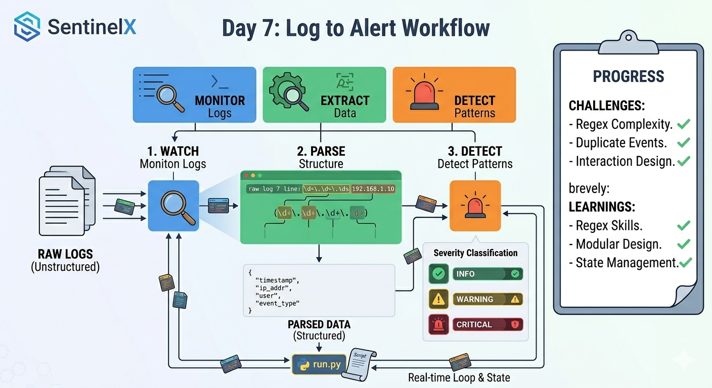

# Day 7 — Parser & Alert Engine Design

## What I Did

- Designed the core architecture of SentinelX
  - Log watcher (real-time monitoring)
  - Parser (converts raw logs into structured data)
  - Alert engine (detects suspicious patterns)

- Understood the difference between
  - Raw log data (unstructured)
  - Parsed data (structured dictionary format)

- Implemented log parsing using Regex patterns

```bash
(\d+\.\d+\.\d+\.\d+) 		
```

	- \d	means any digit 0-9
	- +	means one or more of the previous thing
	- \.	means a literal dot
	- ()	means capture this

- Extracted key information from logs
  - Timestamp
  - Username
  - IP address
  - Port
  -Event type

- Built an Alert Engine to
  - Track failed login attempts per IP
  - Classify severity levels
    - INFO
    - WARNING
    - CRITICAL

- Connected all components in run.py to process logs in real time

## Challenges
- Understanding complex regex patterns
- Avoiding duplicate counting of log events
- Designing clean interaction between components

## What I Learned
- Regex for pattern matching and data extractiong
- Converting unstructured logs into structured data
- Object Oriented Programming
- Importance of modular design (separating watcher, parser, alerts)
- Using classes to maintain state (tracking attempts over time)
- constructor and destructor (magic methods)

## Project Direction Update

- Refined project idea from a simple SSH log reader into

	→ A lightweight real-time security monitoring system (SIEM concept)
- Identified three core pillars
  - Visibility (log monitoring)
  - Accessibility (future dashboard)
  - Control (future response actions)


